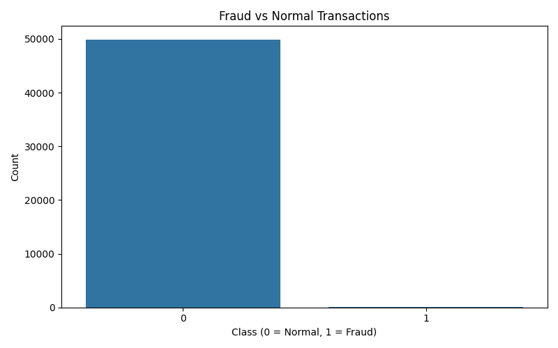
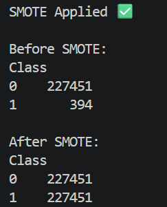
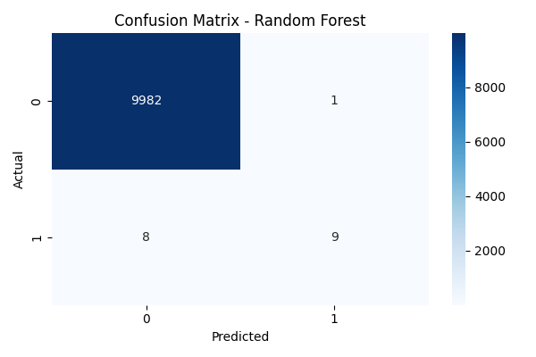

# 💳 Credit Card Fraud Detection System

A Machine Learning project to detect fraudulent credit card transactions using real-world data.

---
## 🚀 Overview
This project identifies fraud transactions by analyzing transaction patterns and handling highly imbalanced data.

---

## 🧠 Approach
- Data preprocessing & EDA  
- SMOTE for imbalance handling  
- Random Forest model  
- Evaluation using confusion matrix  

---

## 🛠 Tech Stack
Python | Pandas | NumPy | Scikit-learn | Matplotlib | Seaborn  


---


## 📸 Outputs

### Imbalanced Data


### SMOTE Applied


### Model Performance


---

## 📥 Dataset
Download from:  
https://www.kaggle.com/datasets/mlg-ulb/creditcardfraud  

Place in:
data/creditcard.csv

---
## ▶️ Run
```
pip install -r requirements.txt
```
```
python train_model.py  

```

---

## 🚀 Future Work
- Enhance application interface  
- Improve model performance  

---

## Author

Nidhi Apotikar

⭐ If you like this project, give it a star!
